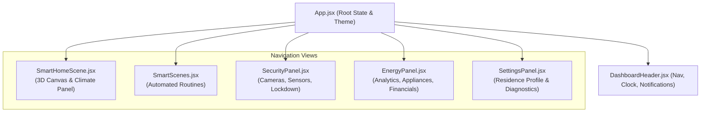

# 🏛️ 3D Smart Home System & Energy Management Dashboard

[](https://react.dev/)
[](https://threejs.org/)
[](https://vitejs.dev/)
[](https://tailwindcss.com/)
[](https://eslint.org/)

An architectural, brutalist-inspired residential automation and monitoring dashboard. Built with **React 19**, **Three.js / React Three Fiber**, and **Tailwind CSS v4**, this application unites spatial 3D visualization, intelligent automated scenes, whole-home security telemetry, sub-metered energy analytics, and financial solar savings modeling into a cohesive interface.

---

## 🌟 Key Highlights & Feature Modules

### 1. 🏠 3D Interactive Residence Model (`SmartHomeScene`)
- **Spatial Architectural Canvas**: Interactive 3D isometric representation of the home floorplan rendered via `@react-three/fiber` and `@react-three/drei`.
- **Room Navigation**: Quick room switching (Living Room, Kitchen, Master Bedroom, Bathroom, Entrance) with interactive 3D highlights and camera orbit constraints.
- **Environmental & Climate Controls**: Real-time per-room temperature stepping (°C), master illumination toggles, and live outdoor weather telemetry (temperature, humidity, wind velocity, UV index).
- **Sub-Device Actuation**: Individual device controls per zone (Smart TV, speakers, HVAC vents, lamps).
- **Proportional UI Sizing**: Balanced 560px canvas-aligned side panel with no awkward empty spaces.

### 2. ⚡ Energy Intelligence & Financial Analytics (`EnergyPanel`)
- **Zone Generation & Storage Telemetry**: Real-time metrics for rooftop solar panels, 13.5 kWh home battery storage, and external grid links.
- **Hourly Generation vs. Consumption Chart**: Dual-bar visual breakdown with timeframe selection (`24h`, `7d`, `30d`), peak draw detection, and interactive hover tooltips.
- **Sub-Metered Appliance Consumption**: Track consumption across 7+ primary home appliances with category filters (*Climate, Mobility, Water, Kitchen, Utility, Media*) and eco-optimization toggles.
- **Financial Analytics & Solar Calculator**:
  - Multi-currency support (**USD $**, **EUR €**, **GBP £**).
  - Dynamic utility tariff selector and custom rate adjuster (`$/kWh`).
  - 4-metric cost overview: *Today's Net Cost*, *Today's Solar Savings*, *Projected Month-End Bill*, *Month-to-Date Solar Savings*.
  - Visual gross energy balance bar demonstrating solar offset percentages and calculated CO₂ reduction (kg).
- **Energy Goals & Budgeting**: Monthly consumption limits, warning threshold states (*normal*, *warning*, *exceeded*), and month-end forecast projections.
- **Live Event Log**: Timestamped operational telemetry feed (e.g., peak solar output, battery charge cycles, EV charging completion).

### 3. 🛡️ Security Center & Access Control (`SecurityPanel`)
- **Live Camera Feeds**: Camera switching for Front Door, Garden, and Driveway feeds with activity statuses.
- **Whole-Home Sensor Network**: Telemetry status grid for door sensors, window contact sensors, and PIR motion detectors with click-to-simulate event triggers.
- **Multi-Level Security Modes**: Instant policy switching between **Disarmed**, **Home**, **Away**, and **Night** profiles.
- **Smart Deadbolt Control**: Direct toggle for the main entrance electronic lock with instant state feedback.
- **Emergency Whole-Home Lockdown**: High-priority panic trigger with a confirmation modal, perimeter siren indicator, and lockdown warning banner.
- **Filterable Access Log**: Searchable and categorized telemetry log (*Secure*, *Activity*, *System*).

### 4. 🌅 Automated Smart Scenes (`SmartScenes`)
- **Orchestrated Routines**: Pre-configured automated routines including *Morning Wakeup*, *Evening Relaxation*, *Movie Night*, *Away Mode*, *Dinner Time*, and *Focus & Work*.
- **Multi-System Actuation**: Simultaneous synchronization of lighting color temperatures, climate setpoints, smart blinds, and media playback.
- **Status Visualizers**: Active indicators, schedule triggers, and scene categorization.

### 5. ⚙️ Residence Settings & Diagnostics (`SettingsPanel`)
- **Home Profile**: Property name, square footage, occupancy count, and timezone configuration.
- **Units & Regional Formatting**: Temperature scale (°C / °F), energy units (kWh / MWh), and currency presets.
- **Notification Preferences**: Granular notification toggles for security alerts, threshold warnings, and daily summaries.
- **Theme & Display Customization**: System Dark/Light mode with `localStorage` persistence and industrial brutalist aesthetics.
- **System Health Diagnostics**: Live network ping latency, Zigbee/Z-Wave mesh node counts, cache management, and simulated diagnostic reboots.

### 6. 🔔 Real-Time Notification Center (`DashboardHeader`)
- **Live System Clock**: Accurate real-time date and time display.
- **Notification Drawer**: Unread badge count, dropdown notifications feed with category badges, individual dismiss actions, and *Mark all read* capability.

---

## 🎨 Design Philosophy & Architecture

The application adopts a **warm brutalist architectural aesthetic**:
- **Palette**: Earthy stone tones (`#f2eee5`, `#f7f4ed`, `#f5f1e8`, `#1c1917`, `#231f1c`, `#292524`).
- **Typography & Form**: Sharp corners (`rounded-none`), hairline borders (`border-stone-300` / `border-stone-700`), uppercase tracking, and clean industrial typography.
- **Layout Precision**: Strict column and card height balancing using CSS Grid and flexbox hierarchies to eliminate empty dead space and ensure pixel-aligned borders across viewports.

---

## 🏗️ Architecture & Component Flow



---

## 💻 Tech Stack

| Technology | Purpose |
| :--- | :--- |
| **React 19** | Modern UI framework with state hooks and concurrent rendering |
| **Three.js** | 3D graphics rendering engine |
| **@react-three/fiber** | Declarative Three.js wrapper for React |
| **@react-three/drei** | High-performance Three.js helper components (OrbitControls, ContactShadows) |
| **Tailwind CSS v4** | Utility-first styling with native CSS nesting and custom color schemes |
| **Lucide React** | Consistent, lightweight SVG iconography |
| **Vite 8** | Next-generation frontend build tooling and instant HMR |
| **ESLint 10** | Strict static code analysis and linting standards |

---

## 🚀 Getting Started

### Prerequisites
- **Node.js**: v18.0.0 or higher
- **npm**: v9.0.0 or higher

### Installation
1. Clone the repository:
   ```bash
   git clone https://github.com/your-username/3D-Home-System.git
   cd 3D-Home-System
   ```
2. Install dependencies:
   ```bash
   npm install
   ```

### Development Server
Run the local Vite development server with Hot Module Replacement (HMR):
```bash
npm run dev
```
Navigate to `http://localhost:5173` in your browser.

### Production Build
Generate an optimized production build:
```bash
npm run build
```
Preview the built bundle locally:
```bash
npm run preview
```

### Linting
Verify code health and styling compliance:
```bash
npm run lint
```

---

## 📂 Project Structure

```text
3D-Home-System/
├── public/                     # Static public assets
├── src/
│   ├── assets/                 # SVGs and images
│   ├── components/
│   │   ├── DashboardHeader.jsx # Global navigation bar, clock, and notifications
│   │   ├── SmartHomeScene.jsx  # Interactive 3D Three.js residence model & climate controls
│   │   ├── SmartScenes.jsx     # Automated home routine orchestrator
│   │   ├── SecurityPanel.jsx   # Multi-zone cameras, sensors, and emergency lockdown
│   │   ├── EnergyPanel.jsx     # Solar analytics, sub-metering, and financial savings
│   │   └── SettingsPanel.jsx   # Residence profile, units, themes, and diagnostics
│   ├── App.jsx                 # Application root, routing state, and theme management
│   ├── index.css               # Global Tailwind CSS imports & animations
│   └── main.jsx                # React DOM entry point
├── eslint.config.js            # ESLint configuration
├── package.json                # Project dependencies and npm scripts
├── vite.config.js              # Vite build setup with Tailwind CSS integration
└── README.md                   # Project documentation
```

---

## 📄 License
This project is open-source under the MIT License.
